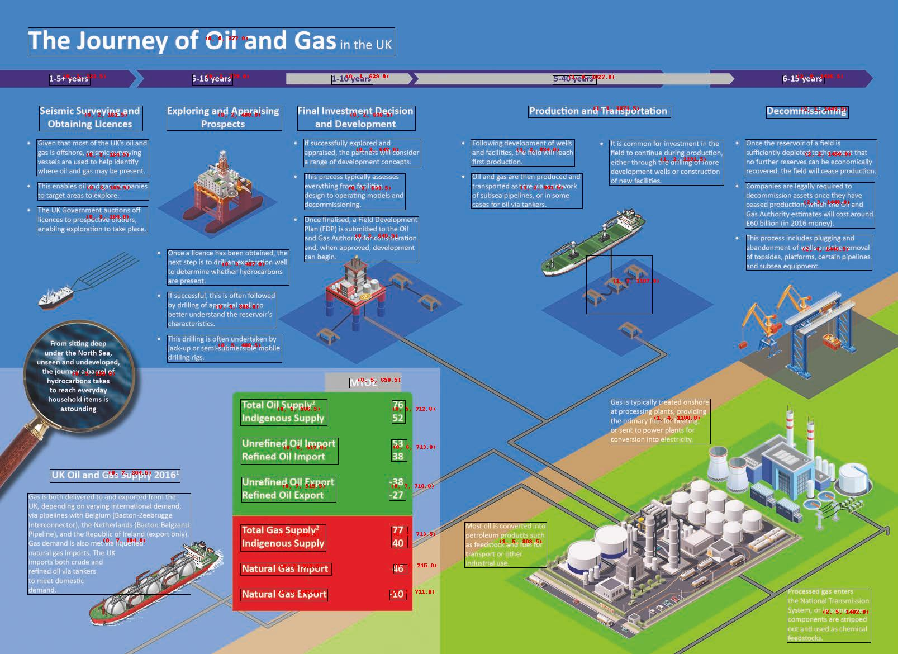
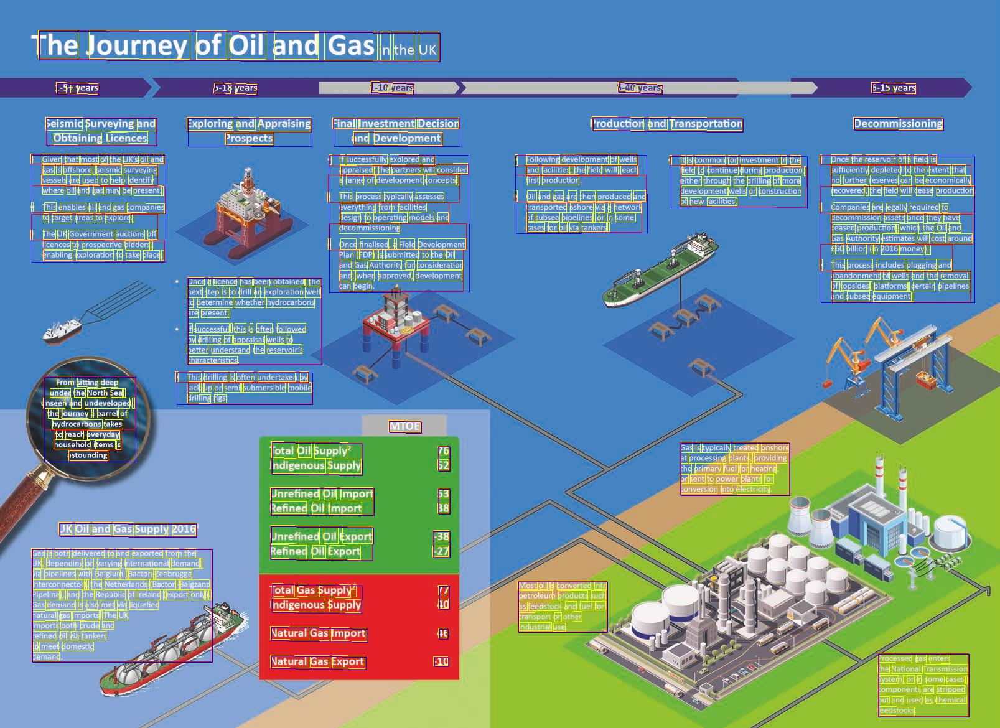
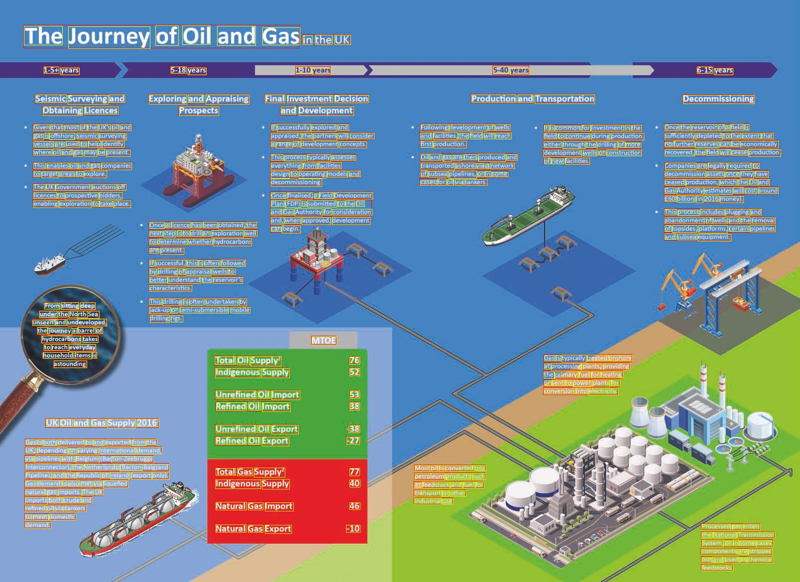
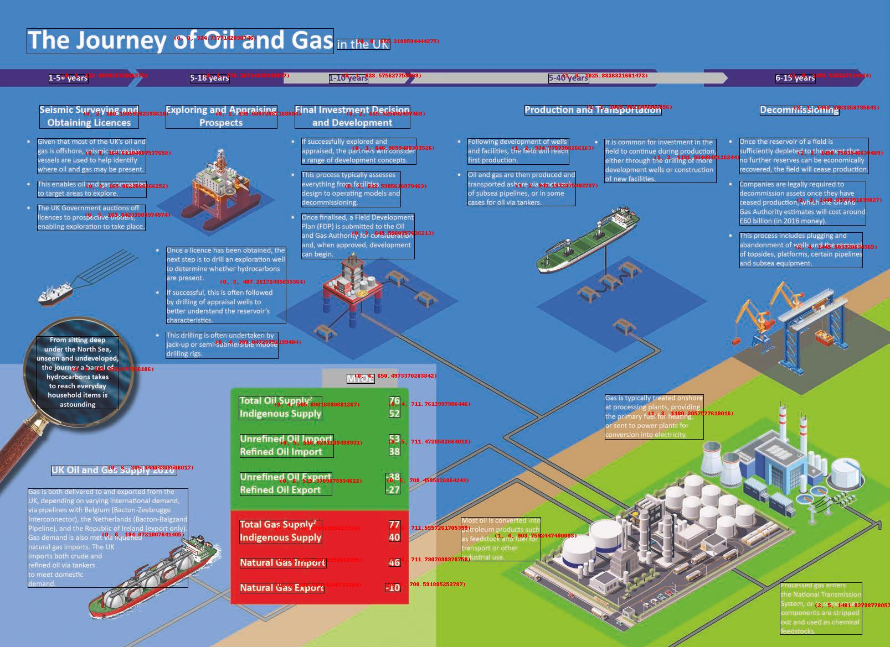

# Complex infographic


This is a more complex infographic with a lot of textual information & not great image resolution. 

Let's dive in each OCR Engine showing you how BBOXHelper supports the coherence of the textual output. 

## Azure 
The below image represents the raw Azure OCR output where we drew each line of text bounding boxes. 


### Azure Raw Text ouput
The below output is not sorted in any just taken as-is from Azure Computer Vision response. 
```
The Journey of Oil and Gas in the UK
1-5+ years
5-18 years
1-10 years
5-40 years
6-15 years
Seismic Surveying and
Exploring and Appraising
Final Investment Decision
Production and Transportation
Decommissioning
Obtaining Licences
Prospects
and Development
Given that most of the UK's oil and
If successfully explored and
Following development of wells
It is common for investment in the
Once the reservoir of a field is
gas is offshore, seismic surveying
appraised, the partners will consider
and facilities, the field will reach
field to continue during production,
sufficiently depleted to the extent that
vessels are used to help identify
a range of development concepts.
first production.
either through the drilling of more
no further reserves can be economically
where oil and gas may be present.
This process typically assesses
Oil and gas are then produced and
development wells or construction
recovered, the field will cease production.
everything from facilities
of new facilities.
This enables oil and gas companies
transported ashore via a network
Companies are legally required to
to target areas to explore.
design to operating models and
of subsea pipelines, or in some
decommission assets once they have
cases for oil via tankers.
ceased production, which the Oil and
The UK Government auctions off
decommissioning.
Gas Authority estimates will cost around
licences to prospective bidders,
Once finalised, a Field Development
£60 billion (in 2016 money).
enabling exploration to take place.
Plan (FDP) is submitted to the Oil
and Gas Authority for consideration
This process includes plugging and
and, when approved, development
abandonment of wells and the removal
Once a licence has been obtained, the
can begin.
of topsides, platforms, certain pipelines
next step is to drill an exploration well
and subsea equipment.
to determine whether hydrocarbons
are present.
AVANA
If successful, this is often followed
by drilling of appraisal wells to
better understand the reservoir's
characteristics.
From sitting deep
This drilling is often undertaken by
under the North Sea,
jack-up or semi-submersible mobile
unseen and undeveloped,
drilling rigs,
the journey a barrel of
hydrocarbons takes
MTOE
to reach everyday
household items is
Gas is typically treated onshore
astounding
Total Oil Supply2
76
Indigenous Supply
52
at processing plants, providing
the primary fuel for heating
or sent to power plants for
Unrefined Oil Import
53
conversion into electricity.
Refined Oil Import
38
UK Oil and Gas Supply 20161
Unrefined Oil Export
-38
Gas is both delivered to and exported from the
Refined Oil Export
-27
UK, depending on varying international demand,
via pipelines with Belgium (Bacton-Zeebrugge
Interconnector), the Netherlands (Bacton-Balgzand
Total Gas Supply2
77
Most oll is converted into
Pipeline), and the Republic of Ireland (export only).
petroleum products such
Gas demand Is also met via liquefied
Indigenous Supply
40
as feedstock and fuel for
natural gas Imports, The UK
transport or other
imports both crude and
Natural Gas Import
46
industrial use.
refined oil via tankers
to meet domestic
demand.
Natural Gas Export
-10
Processed gas enters
the National Transmission
System, or in some cases,
components are stripped
out and used as chemical
feedstocks.
```

Same as the previous, we see an Y-axis/X-axis sorting pattern emerging which brings a lot of inconsistent sentences. 

### Azure BBoxing
Boxes are drawn on the original image. The numbers in red reprensent the blockid we use to sort the final boxes. See our [sorting](/sorting) section for more details. 

#### Azure BBoxing text output
```
The Journey of Oil and Gas in the UK
1-5+ years
5-18 years
1-10 years
Seismic Surveying and Obtaining Licences
Exploring and Appraising Prospects
Final Investment Decision and Development
The UK Government auctions off licences to prospective bidders, enabling exploration to take place.
Given that most of the UK's oil and gas is offshore, seismic surveying vessels are used to help identify where oil and gas may be present.
This enables oil and gas companies to target areas to explore.
Once a licence has been obtained, the next step is to drill an exploration well to determine whether hydrocarbons are present.
This process typically assesses everything from facilities design to operating models and decommissioning.
Once finalised, a Field Development Plan (FDP) is submitted to the Oil and Gas Authority for consideration and, when approved, development can begin.
If successfully explored and appraised, the partners will consider a range of development concepts.
If successful, this is often followed by drilling of appraisal wells to better understand the reservoir's characteristics.
From sitting deep under the North Sea, unseen and undeveloped, the journey a barrel of hydrocarbons takes to reach everyday household items is astounding
This drilling is often undertaken by jack-up or semi-submersible mobile drilling rigs,
Total Oil Supply2 Indigenous Supply
MTOE
76 52
Unrefined Oil Import Refined Oil Import
53 38
Gas is both delivered to and exported from the UK, depending on varying international demand, via pipelines with Belgium (Bacton-Zeebrugge Interconnector), the Netherlands (Bacton-Balgzand Pipeline), and the Republic of Ireland (export only). Gas demand Is also met via liquefied natural gas Imports, The UK imports both crude and refined oil via tankers to meet domestic demand.
UK Oil and Gas Supply 20161
Total Gas Supply2 Indigenous Supply
Natural Gas Export
Natural Gas Import
Unrefined Oil Export Refined Oil Export -38 -27 -10
77 40
46
5-40 years
Production and Transportation
Following development of wells and facilities, the field will reach first production.
Oil and gas are then produced and transported ashore via a network of subsea pipelines, or in some cases for oil via tankers.
It is common for investment in the field to continue during production, either through the drilling of more development wells or construction of new facilities.
AVANA
Gas is typically treated onshore at processing plants, providing the primary fuel for heating or sent to power plants for conversion into electricity.
Most oll is converted into petroleum products such as feedstock and fuel for transport or other industrial use.
6-15 years
Decommissioning
Once the reservoir of a field is sufficiently depleted to the extent that no further reserves can be economically recovered, the field will cease production.
Companies are legally required to decommission assets once they have ceased production, which the Oil and Gas Authority estimates will cost around £60 billion (in 2016 money).
This process includes plugging and abandonment of wells and the removal of topsides, platforms, certain pipelines and subsea equipment.
Processed gas enters the National Transmission System, or in some cases, components are stripped out and used as chemical feedstocks.
```

Here we do have a more concise output, clearly isolating each blocks of text of this infographic. We see the influence of an X axis sorting. 

Let's check on the same example with Google OCR engine... 

## Google 
The below image represents the raw Google OCR output where we drew each line of text bounding boxes. Yellow colored are the words, red is for paragraphs and blue are for the blocks. See [Google Ocr](/google) for more details.


### Google Raw Text output (block level)
```
The Journey of Oil and Gas in the UK
1-5+ years
5-18 years
1-10 years
5-40 years
6-15 years
Production and Transportation
Decommissioning
Seismic Surveying and
Obtaining Licences
Exploring and Appraising
Prospects
Final Investment Decision
and Development
• Given that most of the UK's oil and
gas is offshore, seismic surveying
vessels are used to help identify
where oil and gas may be present.
• This enables oil and gas companies
to target areas to explore.
• The UK Government auctions off
licences to prospective bidders,
enabling exploration to take place.
• It is common for investment in the
field to continue during production,
either through the drilling of more
development wells or construction
of new facilities.
• If successfully explored and
appraised, the partners will consider
a range of development concepts.
. This process typically assesses
everything from facilities
design to operating models and
decommissioning
• Once finalised, a Field Development
Plan (FDP) is submitted to the Oil
and Gas Authority for consideration
and, when approved, development
can begin
• Following development of wells
and facilities, the field will reach
first production
• Oil and gas are then produced and
transported ashore via a network
of subsea pipelines, or in some
cases for oil via tankers.
• Once the reservoir of a field is
sufficiently depleted to the extent that
no further reserves can be economically
recovered, the field will cease production
• Companies are legally required to
decommission assets once they have
ceased production, which the Oil and
Gas Authority estimates will cost around
£60 billion (in 2016 money).
• This process includes plugging and
abandonment of wells and the removal
of topsides, platforms, certain pipelines
and subsea equipment.
Once a licence has been obtained, the
next step is to drill an exploration well
to determine whether hydrocarbons
are present.
If successful, this is often followed
by drilling of appraisal wells to
better understand the reservoir's
characteristics
• This drilling is often undertaken by
jack-up or semi-submersible mobile
drilling rigs
From sitting deep
under the North Sea,
unseen and undeveloped,
the journey a barrel of
hydrocarbons takes
to reach everyday
household items is
astounding
MTOE
Total Oil Supply
Indigenous Supply
76
52
Gas is typically treated onshore
at processing plants, providing
the primary fuel for heating
or sent to power plants for
conversion into electricity
Unrefined Oil Import
Refined Oil Import
53
38
UK Oil and Gas Supply 2016
Unrefined Oil Export
Refined Oil Export
-38
-27
Gas is both delivered to and exported from the
UK, depending on varying international demand,
via pipelines with Belgium (Bacton-Zeebrugge
Interconnector), the Netherlands (Bacton-Baigzand
Pipeline), and the Republic of Ireland (export only).
Gas demand is also met via liquefied
natural gas Imports. The UK
Imports both crude and
refined oil via tankers
to meet domestic
demand
Total Gas Supply?
Indigenous Supply
77
40
Most oll is converted into
petroleum products such
as feedstock and fuel for
transport or other
industrial use
Natural Gas Import
46
Natural Gas Export
-10
Processed gas enters
The National Transmission
System, or in some cases,
components are stripped
out and used as chemical
feedstocks
```

Good job already in isolating the blocks and paragraphs. BBoxHelper would not provide too much enhancements given this output, just re-building sentences and getting rid of too much CR/LF. 

### Google BBoxing 
Boxes are drawn on the original image. The numbers in red reprensent the blockid we use to sort the final boxes. See our [sorting](/sorting) section for more details. 

#### Google BBoxing Text output
```
The
Journey of Oil and Gas in the UK
1-5+ years
5-18 years
1-10 years
Seismic Surveying and Obtaining Licences
Exploring and Appraising Prospects
Final Investment Decision and Development • • •
Given that most of the UK's oil and gas is offshore, seismic surveying vessels are used to help identify where oil and gas may be present. This enables oil and gas companies to target areas to explore. The UK Government auctions off licences to prospective bidders, enabling exploration to take place.
Once a licence has been obtained, the next step is to drill an exploration well to determine whether hydrocarbons are present. If successful, this is often followed by drilling of appraisal wells to better understand the reservoir's characteristics .
• •
This process typically assesses everything from facilities design to operating models and decommissioning Once finalised, a Field Development Plan (FDP) is submitted to the Oil and Gas Authority for consideration and, when approved, development can begin
If successfully explored and appraised, the partners will consider a range of development concepts.
From sitting deep under the North Sea, unseen and undeveloped, the journey a barrel of hydrocarbons takes to reach everyday household items is astounding •
This drilling is often undertaken by jack-up or semi-submersible mobile drilling rigs
Total Oil Supply Indigenous Supply
MTOE
76 52
Unrefined Oil Import Refined Oil Import
53 38
Gas is both delivered to and exported from the UK, depending on varying international demand, via pipelines with Belgium (Bacton-Zeebrugge Interconnector), the Netherlands (Bacton-Baigzand Pipeline), and the Republic of Ireland (export only). Gas demand is also met via liquefied natural gas Imports. The UK Imports both crude and refined oil via tankers to meet domestic demand
UK Oil and Gas Supply 2016
Total Gas Supply? Indigenous Supply
Natural Gas Export
Natural Gas Import
Unrefined Oil Export Refined Oil Export -10 -38 -27
46
77 40
5-40 years
Production and Transportation • •
Following development of wells and facilities, the field will reach first production Oil and gas are then produced and transported ashore via a network of subsea pipelines, or in some cases for oil via tankers.
•
It is common for investment in the field to continue during production, either through the drilling of more development wells or construction of new facilities.
Gas is typically treated onshore at processing plants, providing the primary fuel for heating or sent to power plants for conversion into electricity
Most oll is converted into petroleum products such as feedstock and fuel for transport or other industrial use • • •
6-15 years
Decommissioning
Once the reservoir of a field is sufficiently depleted to the extent that no further reserves can be economically recovered, the field will cease production Companies are legally required to decommission assets once they have ceased production, which the Oil and Gas Authority estimates will cost around £60 billion (in 2016 money). This process includes plugging and abandonment of wells and the removal of topsides, platforms, certain pipelines and subsea equipment.
Processed gas enters The National Transmission System, or in some cases, components are stripped out and used as chemical feedstocks
```

## AWS 
The below image represents the raw AWS Textextract output where we drew each line of text bounding boxes. Yellow colored are the words, red is for lines. See [AWS Ocr](/engines/aws) for more details.

### AWS Raw Text output 
```
The Journey of Oi and Gas
in the UK
1-5+ years
5-18 years
1-10 years
5-40 years
6-15 years
Seismic Surveying and
Exploring and Appraising
Final Investment Decision
Production and Transportation
Decommissioning
Obtaining Licences
Prospects
and Development
Given that most of the UK's oi and
If successfully explored and
Following development of wells
It is common for investment in the
Once the reservoir of a field is
gas is offshore seismic surveying
appraised, the partners will consider
and facilities, the field will reach
field to continue during production
sufficiently depleted to the extent that
vessels are used to help identify
a range of development concepts
first production.
either through the drilling of more
no further reserves can be economically
where oil and gas may be present.
development wells or construction
recovered, the field will cease production.
This process typically assesses
Oi and gas are then produced and
of new facilities.
This enables oil and gas companies
everything from facilities
transported ashore via a network
Companies are legally required to
to target areas to explore.
design to operating models and
of subsea pipelines, or in some
decommission assets once they have
decommissioning
cases for oi via tankers.
ceased production, which the oil and
The UK Government auctions off
Gas Authority estimates will cost around
licences to prospective bidders,
Once finalised a Field Development
E60 billion (in 2016 money).
enabling exploration to take place.
Plan and Gas (FDP) Authority is submitted for consideration to the oil
This process includes plugging and
and, when approved development
abandonment of wells and the removal
Once a licence has been obtained the
can begin.
of topsides platforms, certain pipelines
next step Is to drill an exploration well
and subsea equipment.
to determine whether hydrocarbons
are present.
If successful, this is often followed
by drilling of appraisa wells to
better understand the reservoir's
characteristics.
From sitting deep
This drilling is often undertaken by
jack-up or semi-submersible mobile
under the North rth Sea
unseen and undeveloped
drilling rigs,
the journey a barrel of
hydrocarbons takes
MTOE
to reach everyday
household items is
astounding
Total Oil Supply
76
Gas is typically treated onshore
at processing plants providing
Indigenous Supply
52
the primary fuel for heating
or sent to power plants for
Unrefined Oil Import
53
conversion into electricity.
Refined Oil Import
38
UK Oil and Gas Supply 2016
Unrefined Oil Export
38
Gas is both delivered to and exported from the
Refined Oil Export
-27
UK depending on varying international demand;
via pipelines with Belgium ton-Zeebrugge
Interconnector) the Netherlands (Bacton -Baigzand
Pipeline) and the Republic of Ireland (export only).
Total Gas Supply
77
Most ol is converted Into
petroleum products such
Gas demand Is also met via liquefied
Indigenous Supply
40
as feedstock and fuel for
natura gas Imports. The UK
transport or other
imports both crude and
industrial use
refined oi via tankers
Natural Gas Import
46
to mneet domestic
demand.
Natural Gas Export
-10
Processed gas enters
the Nationa Transmission
System ot in same cases
components are stripped
out and used as chemical
feedstocks
```
### AWS BBoxing 
Boxes are drawn on the original image. The numbers in red reprensent the blockid we use to sort the final boxes. See our [sorting](/sorting) section for more details. 

#### AWS BBoxing text output
```
The Journey of Oi and Gas in the UK
1-5+ years
5-18 years
1-10 years
Seismic Surveying and Obtaining Licences
Exploring and Appraising Prospects
Final Investment Decision and Development
The UK Government auctions off licences to prospective bidders, enabling exploration to take place.
Given that most of the UK's oi and gas is offshore seismic surveying vessels are used to help identify where oil and gas may be present.
This enables oil and gas companies to target areas to explore.
Once a licence has been obtained the next step Is to drill an exploration well to determine whether hydrocarbons are present. If successful, this is often followed by drilling of appraisa wells to better understand the reservoir's characteristics.
This process typically assesses everything from facilities design to operating models and decommissioning
Once finalised a Field Development Plan and Gas (FDP) Authority is submitted for consideration to the oil and, when approved development can begin.
If successfully explored and appraised, the partners will consider a range of development concepts
From sitting deep under the North rth Sea unseen and undeveloped the journey a barrel of hydrocarbons takes to reach everyday household items is astounding
This drilling is often undertaken by jack-up or semi-submersible mobile drilling rigs,
Total Oil Supply Indigenous Supply
MTOE
76 52
Unrefined Oil Import Refined Oil Import
53 38
Gas is both delivered to and exported from the UK depending on varying international demand; via pipelines with Belgium ton-Zeebrugge Interconnector) the Netherlands (Bacton -Baigzand Pipeline) and the Republic of Ireland (export only). Gas demand Is also met via liquefied natura gas Imports. The UK imports both crude and refined oi via tankers to mneet domestic demand.
UK Oil and Gas Supply 2016
Total Gas Supply Indigenous Supply
Natural Gas Export
Natural Gas Import
Unrefined Oil Export Refined Oil Export
38 -27 -10
77 40
46
5-40 years
Production and Transportation
Following development of wells and facilities, the field will reach first production.
Oi and gas are then produced and transported ashore via a network of subsea pipelines, or in some cases for oi via tankers.
It is common for investment in the field to continue during production either through the drilling of more development wells or construction of new facilities.
Gas is typically treated onshore at processing plants providing the primary fuel for heating or sent to power plants for conversion into electricity.
Most ol is converted Into petroleum products such as feedstock and fuel for transport or other industrial use
6-15 years
Decommissioning
Once the reservoir of a field is sufficiently depleted to the extent that no further reserves can be economically recovered, the field will cease production.
Companies are legally required to decommission assets once they have ceased production, which the oil and Gas Authority estimates will cost around E60 billion (in 2016 money).
This process includes plugging and abandonment of wells and the removal of topsides platforms, certain pipelines and subsea equipment.
Processed gas enters the Nationa Transmission System ot in same cases components are stripped out and used as chemical feedstocks
```

## Conclusion

With this example we can see that both outputs are more aligned after BBoxing whether you use Azure OCR or Google OCR you would get a similar output. 

This sort of consistency regardless of the OCR engine is what this project is about. 
